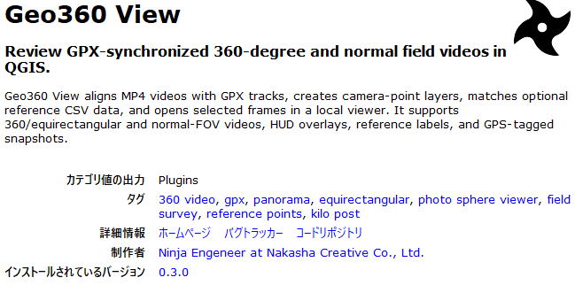
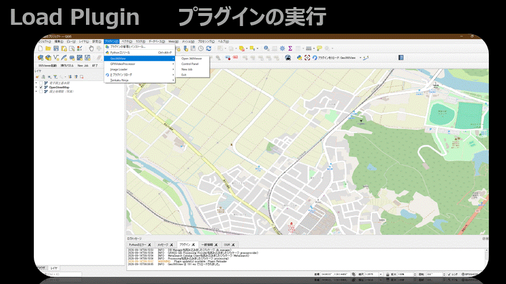
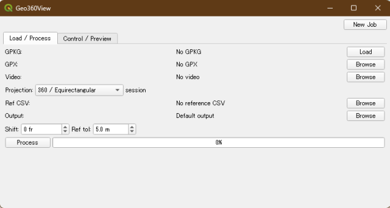
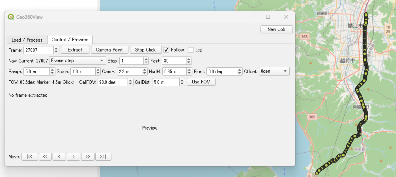
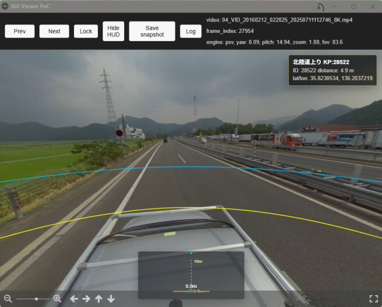
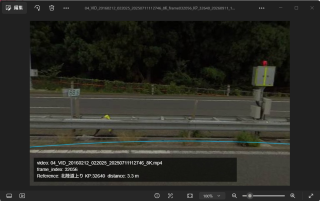
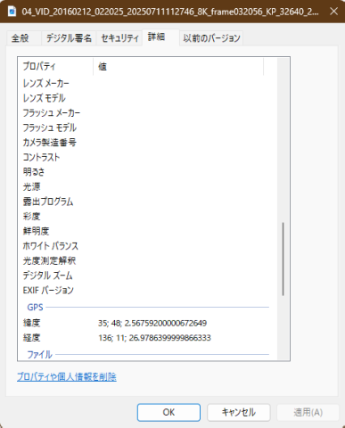

# Geo360 View

[Japanese README](README_ja.md)

Geo360 View is a QGIS plugin for reviewing GPX-synchronized 360-degree and normal field videos on a map, with viewer-side Markings that can restore bookmarked directions later.

## Japanese-first support

Geo360 View is currently released as a trial version. The primary support language is Japanese.

For installation, usage, operation reports, bug reports, and discussions, please start with the Japanese README:

- [README_ja.md](README_ja.md)
- [Operation report form](https://github.com/yoshiyuki-matsui/Geo360View/issues/new?template=operation-report.yml)
- [Bug report form](https://github.com/yoshiyuki-matsui/Geo360View/issues/new?template=bug-report.yml)
- [GitHub Discussions](https://github.com/yoshiyuki-matsui/Geo360View/discussions)

Reports in English are welcome, but responses may be written in Japanese and/or machine-translated.

It aligns an MP4 video with a GPX track, creates frame-by-frame camera points, and opens selected frames in a browser-based viewer. Double-clicking a target in the viewer stores a Marking with the frame, viewing direction, and zoom for restoring that viewer context. Optional reference point CSV data can be matched to camera points, so known KP markers, utility poles, bridges, facilities, or inspection points can be reviewed directly against the recorded scene.

Geo360 View is more than a playback viewer. It produces reusable intermediate outputs such as camera-point GeoPackages, Marking layers, matched reference CSV files, cached frame images, and GPS-tagged snapshots.



### OverView

### Panel

### Shooting Points

### 360 HUD Viewer

### Save Snap Shot

### EXIF Tag


## Features

- Read GPX tracks and interpolate camera positions to MP4 frame numbers.
- Apply a frame shift to align video frames and GNSS positions.
- Create a `Video GPX Points` layer in QGIS.
- Optionally match generated camera points to a reference point CSV, such as KP markers, utility poles, bridges, or facility master points.
- Open a local browser viewer from QGIS.
- Display 360/equirectangular frames and normal-FOV frames.
- Switch frames without exporting the whole video to images.
- Preserve viewer yaw, pitch, and zoom while navigating.
- Add Markings in 360 space and later restore the saved frame, view direction, and zoom.
- Store Markings as a `geo360_markings` GeoPackage layer that can be related to snapshots and camera points by `frame`.
- Show map-side and viewer-side HUD guides for orientation and distance cues.
- Show matched reference attributes as an overlay in the viewer.
- Save GPS-tagged snapshots with optional HUD/reference overlays.
- Save and restore a GeoPackage work session.
- Use Photo Sphere Viewer as the open viewer engine, with a krpano-compatible integration path kept for local evaluation.

## Viewer Engines

Geo360 View currently supports two viewer paths:

- `psv`: Photo Sphere Viewer + MarkersPlugin.
- `krpano`: legacy/local evaluation path.

The Photo Sphere Viewer path reuses the same local HTTP API, image cache, and `viewer_session.json` state as the krpano path. This keeps the QGIS side independent from the browser viewer implementation.

## Marking

Marking is a lightweight bookmark in 360 space. Double-click a point in the viewer to store the video name, `frame`, clicked direction, viewer center direction, and `zoom`.

Saved Markings can be reviewed with the `Marking` navigation mode. Geo360 View restores the saved frame, view direction, and zoom, so the same target can be checked again later. Marking markers are also drawn into snapshots, allowing the GPKG Marking record and evidence image to be related by `frame`.

Markings are review bookmarks, not deliverable POIs or survey-grade results. New Markings are saved as non-geometry records for viewer restoration, not as asserted object locations. Classification, formal attributes, quality control, and final POI production are outside the scope of this public viewer.

## Scope

This public-oriented plugin is limited to video/GPX synchronization, visual review, Marking bookmarks, and evidence snapshots. Automatic object detection, POI generation, semantic clustering, formal POI management, and model-review workflows are intentionally outside this repository.

## Security and Privacy

Geo360 View is a local QGIS plugin intended to run on the user's machine. It does not intentionally upload MP4, GPX, CSV, Marking, or snapshot data to an external server.

However, 360-degree videos, GPX tracks, reference CSV files, GeoPackages, and GPS-tagged snapshots may contain sensitive information such as people, vehicles, addresses, facilities, and travel routes. Review data carefully before sharing it publicly, attaching it to issues, or using it as sample data.

The local browser viewer is intended for `localhost` use. Do not expose the local viewer port to untrusted networks.

Download release ZIP files from GitHub Releases. Do not install plugin ZIP files from untrusted sources.

For vulnerability or privacy reports, do not post sensitive details in public issues. See [SECURITY.md](SECURITY.md).

## Requirements

- QGIS 3.40 or later.
- QGIS Python with OpenCV (`cv2`) available.
- A browser that can open the local viewer, preferably Edge or Chrome.

## Install

For normal use, install the release ZIP from GitHub Releases.

1. Download a release ZIP such as `Geo360View-0.5.0.zip` from [GitHub Releases](https://github.com/yoshiyuki-matsui/Geo360View/releases).
2. Open QGIS.
3. Open `Plugins` -> `Manage and Install Plugins`.
4. Choose `Install from ZIP` and select the downloaded ZIP file.
5. Restart QGIS after installation.

The ZIP downloaded from GitHub's `Code > Download ZIP` button is a source archive and may have a folder name/layout that differs from a QGIS plugin distribution ZIP. For normal installation, use the ZIP attached to a GitHub Release.

For development builds, install the plugin directory into your QGIS Python plugin folder and restart QGIS.

On Windows, the default user plugin folder is typically:

```text
C:\Users\<user>\AppData\Roaming\QGIS\QGIS3\profiles\default\python\plugins\Geo360View
```

## OpenCV Setup For Windows/QGIS

If QGIS reports that `cv2` is not available, install OpenCV into the Python environment used by QGIS. Installing OpenCV into a normal Windows Python, Conda, or another virtual environment may not make it available from QGIS.

For OSGeo4W/QGIS on Windows, open **OSGeo4W Shell** from the Start menu and run:

```bash
python -m pip install --upgrade pip setuptools wheel
python -m pip install --upgrade --only-binary=:all: "opencv-python>=4.8"
python -m pip check
python -c "import cv2; print(cv2.__version__)"
```

If the second command prints an OpenCV version, the QGIS Python environment can import `cv2`.

After installing OpenCV, **fully quit and restart QGIS**. Python packages installed from OSGeo4W Shell are not loaded into an already running QGIS process.

Useful checks:

```bash
python -c "import sys; print(sys.executable)"
python -c "import numpy; print('numpy', numpy.__version__)"
python -c "import cv2; print('opencv', cv2.__version__)"
```

Notes:

- Avoid upgrading `numpy` manually unless you have to. QGIS, GDAL, and OSGeo4W packages share the same Python environment, and an unnecessary `numpy` upgrade may create binary compatibility issues.
- Prefer installing/updating `opencv-python` first, then run `python -m pip check`.
- To keep a record before changing the environment:

```bash
python -m pip freeze > qgis_python_packages_before.txt
```

## Input Data

- MP4 video recorded along a route.
- GPX track recorded during the same run.
- Optional reference point CSV with latitude/longitude columns.

Sample MP4/GPX data is not bundled. 360-degree videos are large and may contain privacy-sensitive information such as people, vehicles, and surrounding properties. Please try Geo360 View with your own MP4 and GPX recorded during the same run, for example from Insta360, RICOH THETA, GoPro MAX, or similar cameras.

For practical performance, copy MP4 files to a local SSD or other local disk
before processing. Reading large MP4 files from NAS, SMB/NFS shares, cloud-sync
folders, or VPN-mounted storage can make frame extraction and viewer navigation
very slow because Geo360 View reads video frames on demand.

Reference CSV files should be saved as UTF-8. When editing with Microsoft Excel, choose `CSV UTF-8 (Comma delimited) (*.csv)`. If Japanese text is garbled, reopen the CSV in a text editor such as Sakura Editor or VS Code and save it again as UTF-8.

Minimal reference CSV example:

```csv
id,name,latitude,longitude
1991,Route A KP:1991,35.97173562,136.2038756
2034,Route A KP:2034,35.97156058,136.2037934
```

`name` is used as the viewer label when present. The matched output also preserves `reference_id`, `reference_name`, and `reference_label` fields.

## Outputs

Geo360 View keeps the original video as the source of truth and writes practical intermediate outputs:

- `Video GPX Points` QGIS layer.
- Frame-position CSV files.
- Reference-matched CSV files.
- Navigation JSON for the local viewer.
- `geo360_markings` Marking layer.
- On-demand viewer cache images.
- GPS EXIF snapshots with optional HUD and reference overlays.

For 360-degree videos, cached frame images are equirectangular intermediate images. Snapshots are the human-readable view images generated from the current viewer direction.

## Known Limitations

- Sample video data is not bundled because 360-degree video files are usually large and may contain privacy-sensitive content.
- Network or VPN storage can be much slower than local disks for MP4 access. Local execution with local video files is recommended.
- QGIS 4/Qt 6 compatibility is experimental.
- Snapshot image quality depends on source video quality, cache image resolution, viewer rendering, and JPEG compression.
- The krpano path is kept for local compatibility checks only. Photo Sphere Viewer is the preferred open distribution path.

## Contact

For operation reports and bug reports, please use GitHub Issues:

https://github.com/yoshiyuki-matsui/Geo360View/issues

For questions, usage ideas, and use-case discussions, please use GitHub Discussions:

https://github.com/yoshiyuki-matsui/Geo360View/discussions

Support is primarily provided in Japanese. Reports in English are welcome, but responses may be written in Japanese and/or machine-translated.

For business inquiries, custom workflows, automatic POI generation, object detection, or reporting, contact:

rdcenter.nakashacreative@gmail.com

## License

Geo360 View is licensed under GPL-2.0-or-later to align with QGIS plugin distribution requirements.

Bundled browser-side open source components are distributed under their own licenses:

- Photo Sphere Viewer core: MIT
- Photo Sphere Viewer MarkersPlugin: MIT
- three.js: MIT

krpano is not bundled. If you use the legacy krpano path locally, place your own licensed krpano runtime according to the krpano license.

## Documentation

- [DESIGN.ja.md](DESIGN.ja.md): Japanese design notes.
- [DESIGN.md](DESIGN.md): English design notes.
- [CHANGELOG.md](CHANGELOG.md): release notes.
- [samples/README.md](samples/README.md): sample data policy and input notes.
