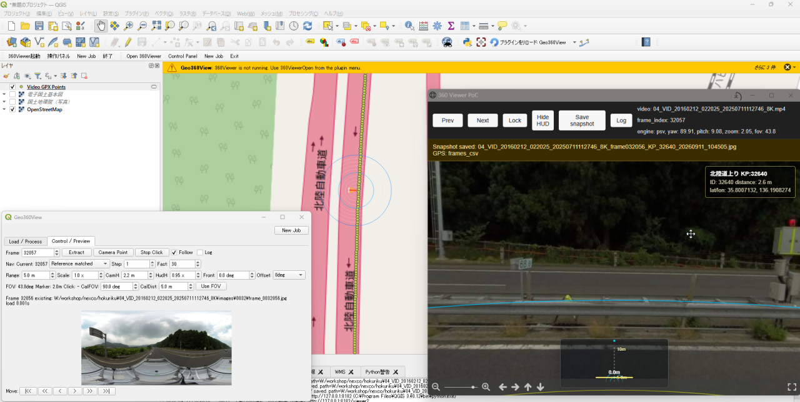

# Geo360 View

[English README](README.md)

Geo360 Viewは、GPXと同期した360度動画および通常画角動画を、QGISの地図上から確認するためのQGISプラグインです。

MP4動画とGPX軌跡を同期し、フレームごとの撮影点を生成します。地図上の撮影点を選ぶと、対応するフレームをブラウザビューアで確認できます。任意の参照点CSVを指定すると、KP、電柱、橋梁、施設、点検対象点などのマスタ情報を撮影点に最近接マッチングし、実写と属性を重ねて確認できます。

Geo360 Viewは単なる再生ビューアではありません。撮影点GeoPackage、フレームCSV、参照点マッチCSV、閲覧用キャッシュ画像、GPS EXIF付きスナップショットなど、GISで再利用できる中間成果物を生成します。


### 概要

### 操作パネル

### 撮影点

### ビューア表示

### スナップショット保存

### EXIFタグ


## できること

- GPX軌跡を読み込み、MP4のフレーム番号へ撮影位置を補間します。
- フレームシフトを指定して、映像フレームとGNSS位置のずれを調整できます。
- QGIS上に`Video GPX Points`レイヤを生成します。
- KP、電柱、橋梁、施設マスタなどの参照点CSVと最近接マッチングできます。
- QGISからローカルブラウザビューアを開けます。
- 360度/equirectangular画像と通常画角画像を表示できます。
- 動画全体を静止画化せず、必要なフレームだけをオンザフライで表示します。
- フレーム移動時にyaw、pitch、zoomを保持できます。
- 地図側とビューア側にHUD、同心円、視点ロック補助を表示できます。
- マッチした参照点の日本語属性をビューア上にオーバーレイ表示できます。
- HUDや参照点情報を重ねたGPS EXIF付きスナップショットを保存できます。
- 作業中のGeoPackageを保存・復元できます。

## ビューア

Geo360 Viewは2つのビューア経路を持っています。

- `psv`: Photo Sphere Viewer + MarkersPlugin。公開版の主経路です。
- `krpano`: 既存互換確認用のローカル経路です。

Photo Sphere Viewer経路は、既存のローカルHTTP API、画像キャッシュ、`viewer_session.json`を再利用します。QGIS側の処理はビューア実装から疎結合になっています。

## 公開版の範囲

この公開版は、動画とGPXの同期、撮影点レイヤ生成、参照点CSVとのマッチング、ブラウザビューアでの目視確認に範囲を絞っています。

以下は本リポジトリの対象外です。

- 自動物体検出
- YOLO/RF-DETRなどのモデル実行
- POI候補生成、集約、管理
- semantic classに基づく候補レイヤ表示
- モデル比較、検出結果レビュー
- 帳票生成などの業務ワークフロー

これらの高度な業務処理は、GPXVideoProcessorおよび関連商用サービス側の領域です。

## 必要環境

- QGIS 3.40以降
- QGISが使用するPython環境でOpenCV、つまり`cv2`が利用できること
- ローカルビューアを開けるブラウザ。EdgeまたはChromeを推奨します

## インストール

プラグインディレクトリをQGISのPythonプラグインフォルダへ配置し、QGISを再起動してください。

Windowsの標準的な配置先は以下です。

```text
C:\Users\<user>\AppData\Roaming\QGIS\QGIS3\profiles\default\python\plugins\Geo360View
```

QGISで`cv2`が見つからない場合は、通常のWindows PythonやCondaではなく、QGISが使っているPython環境にOpenCVを入れてください。

OSGeo4W/QGIS on Windowsの場合:

```bash
python -m pip install "opencv-python>=4.8"
python -c "import cv2; print(cv2.__version__)"
```

## 入力データ

- 同一路線・同一走行で撮影したMP4動画
- 同じ走行時に取得したGPX軌跡
- 任意の参照点CSV

参照点CSVはUTF-8で保存してください。Excelで編集する場合は「CSV UTF-8（コンマ区切り）（*.csv）」を選択してください。日本語が文字化けする場合は、Sakura EditorやVS Codeなどで開き、UTF-8で保存し直してください。

最小構成の参照点CSV例:

```csv
id,name,latitude,longitude
1991,北陸道上り KP:1991,35.97173562,136.2038756
2034,北陸道上り KP:2034,35.97156058,136.2037934
```

`name`列がある場合、ビューア上の表示ラベルとして使われます。マッチング結果には`reference_id`、`reference_name`、`reference_label`も出力されます。

## 出力されるもの

Geo360 Viewは元動画を正として保持し、作業結果として以下の中間成果物を出力します。

- `Video GPX Points` QGISレイヤ
- フレーム位置CSV
- 参照点マッチCSV
- ローカルビューア用のナビゲーションJSON
- オンザフライ表示用のキャッシュ画像
- HUDや参照点情報を含むGPS EXIF付きスナップショット

360度動画の場合、キャッシュ画像はequirectangular形式の中間画像です。スナップショットは、現在の視点方向から生成される、人が見て分かる通常の静止画です。

## 既知の制限

- 360度動画は大容量で、プライバシー情報を含む可能性があるため、現時点ではサンプル動画を同梱していません。
- QGIS 4/Qt 6対応は実験的です。
- 表示画質やスナップショット画質は、元動画、キャッシュ画像解像度、ビューア描画、JPEG圧縮の影響を受けます。
- krpano経路はローカル互換確認用です。公開配布の主経路はPhoto Sphere Viewerです。


## ライセンス

Geo360 Viewは、QGISプラグイン配布要件に合わせてGPL-2.0-or-laterで提供します。

同梱するブラウザ側OSSコンポーネントは、それぞれのライセンスに従います。

- Photo Sphere Viewer core: MIT
- Photo Sphere Viewer MarkersPlugin: MIT
- three.js: MIT

krpanoは同梱しません。ローカルで旧krpano経路を使う場合は、krpanoのライセンスに従って利用者自身のランタイムを配置してください。

## ドキュメント

- [DESIGN.ja.md](DESIGN.ja.md): 日本語設計メモ
- [DESIGN.md](DESIGN.md): 英語設計メモ
- [CHANGELOG.md](CHANGELOG.md): 変更履歴
- [samples/README.md](samples/README.md): サンプルデータ方針と入力データメモ


## 問い合わせ

バグの発見、機能の要望などはGitHubのIssuesまでお願いします:
https://github.com/yoshiyuki-matsui/Geo360View/issues

業務フローへの組み込み、自動POI生成、物体・損傷検出モデル、検出結果レイヤ出力、レイヤスタイル適用、報告書生成などのご依頼は下記までご連絡ください:
rdcenter.nakashacreative@gmail.com

